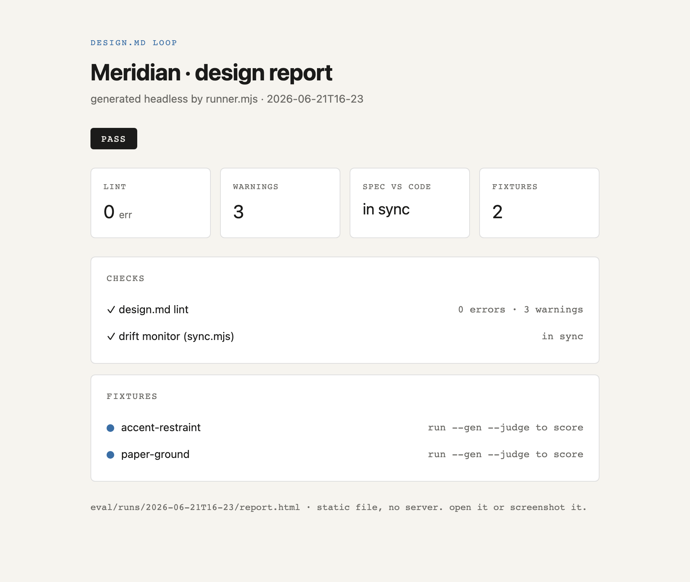

# designmd-loop

Turn a `DESIGN.md` into a design system that checks itself.

[Google's design.md](https://github.com/google-labs-code/design.md) is a great primitive: one portable file that hands a coding agent your design system as tokens plus prose. But a file is a snapshot. It does not know your code, nobody enforces it, and it cannot tell when the design has drifted past it.

`designmd-loop` is a small kit that closes that gap. It sits on top of the design.md format (it does not fork the CLI) and adds three things:

- **A token gate** that scores any generated UI against the spec's own rules.
- **A drift monitor** that tells you when your live code has outgrown the spec.
- **A live panel** (and a matching headless HTML report) you can open, watch, and screenshot.

No dependencies to install. No build. The whole loop is plain Node.



## Try it in 60 seconds (designers, start here)

The repo ships a complete, fictional example design system ("Meridian") so you can run the whole loop with zero setup. There is nothing to `npm install`.

```bash
git clone https://github.com/RSLVD/designmd-loop && cd designmd-loop
npm start
```

That opens a **live panel** in your browser, in the RSLVD design language. In one page you see:

- a **gallery of sample UIs rendered** and scored (compliant screens pass, the broken one is caught on purpose). Drop any `example/*-sample.html` in and it auto-appears as a tile,
- every **token as a swatch**, spec vs. your live code,
- the **lint, drift, and gate** results,
- a **connector wizard** (the "Add connectors" button) to point the loop at your own project, and
- a **"Make it yours"** guide, inline.

### Watch it react (the whole point)

Leave the panel open and edit a color in **`example/tokens.css`** (change a hex, or add a new line like `--brand: #d23f87;`). Save. The panel **reloads itself**: a new `EVOLVED` swatch appears, the "spec vs code" card flips to **drift**, and the top badge turns to *needs attention*. Revert the change and it goes green again.

That is the loop, made visible: the spec tracks the code, not the other way around.

> Prefer no browser? `npm run demo` runs the identical checks headless and writes a static `eval/runs/<stamp>/report.html` (the image above). `npm run check` is the lint + drift gate for CI.

## Give it to Claude

You do not have to run anything by hand. Open a fresh Claude Code session and paste this, with the repo URL:

> Clone `https://github.com/RSLVD/designmd-loop`, set it up as a project, and start the design panel on localhost. Then walk me through pointing it at this project's CSS with the connector wizard.

Claude clones the repo, runs `npm start` (no install needed), and hands you the localhost URL. The repo ships a `CLAUDE.md` and a Claude Code skill (`.claude/skills/designmd-loop/`) so the session already knows how to run the loop and reason about drift.

## Make it yours

The fastest path is the **connector wizard**. Run `npm start`, click **Add connectors**, and walk five steps:

1. **Your spec** - the path to your `DESIGN.md` (colors, type, components, a `retired:` list). The wizard tests the connection and counts your tokens.
2. **Your live code** - the styling file where your tokens actually live (`src/styles/globals.css`, a Tailwind config, etc.).
3. **Your screens** - the HTML the gate should score, one per line (append `:: FAIL` to mark a screen that should fail).
4. **The Claude judge** - optional, toggled on or off (it shells out to the `claude` CLI; no key is ever stored).
5. **Review and connect** - this writes `designmd-loop.config.json` and reloads the panel pointed at your project.

That config file is per-machine and git-ignored. Prefer the command line? Everything the wizard does, you can do by hand:

```bash
DESIGNMD_LIVE=src/styles/globals.css npm start      # live panel
DESIGNMD_LIVE=src/styles/globals.css npm run check  # headless gate
```

Then **author your real spec** (`design-md/SKILL.md` walks a coding agent through building `DESIGN.md` from your existing code) and **wire it into CI**: the ready-made GitHub Action in `.github/workflows/design-check.yml` runs lint + drift + gate on every push and PR. No secrets needed.

## Where to go from here

- **Replace Meridian with your system.** Delete the demo colors in `DESIGN.md` and author your own. `design-md/SKILL.md` walks a coding agent through building the spec from your existing code and notes.
- **Grow the fixture suite.** Each folder in `eval/fixtures/` is a prompt plus the spec sections it must honor. Add your own real screens to score more of your surface.
- **Turn on the optional Claude judge** for the softer qualities (see below).
- **Make the gate block bad ships.** Add `npm run check` to a pre-commit hook so drift and lint errors never merge.

## Commands

| Command | What it does |
|---|---|
| `npm start` | Open the **live panel** (renders samples + swatches, reloads on save) |
| `npm run demo` | The full loop headless, writes a static HTML report |
| `npm test` | The gate self-test + drift monitor (what CI runs) |
| `npm run lint` | Lint `DESIGN.md` (broken refs, WCAG contrast) via `@google/design.md` |
| `npm run sync` | Drift monitor: live code vs spec |
| `npm run gate` | Token gate self-test (good sample passes, bad fails) |
| `npm run report` | Emit the static HTML report |
| `npm run check` | `lint` + `sync` (the CI / pre-deploy gate) |

The panel honors `PORT` (default 4173) and `DESIGNMD_LIVE` (default `example/tokens.css`).

## How drift monitoring works

The whole idea is that the spec tracks the code, so the monitor reads both and diffs them.

1. It parses the **color tokens** declared in `DESIGN.md`'s YAML front matter (skipping the `retired:` list).
2. It parses the **CSS custom properties** (`--name: #hex` or `rgba(...)`) in your live file (`example/tokens.css` by default, or whatever `DESIGNMD_LIVE` points at).
3. It classifies every gap:
   - **EVOLVED** - a color in your code that the spec does not know. The code grew; fold it into `DESIGN.md`.
   - **STALE** - a color in the spec that is no longer in your code.
   - **IN SYNC** - they match.

`npm run sync` does this once and exits non-zero on drift, which is what makes it a usable CI or pre-commit gate. The **panel does it continuously**: it polls the watched files about twice a second and reloads when you save, so the swatches and the drift card move as you type. The code is the source of truth; the spec tracks it.

Today the monitor diffs colors. Typography, spacing, and rounding live in `DESIGN.md` and are linted, but are not yet drift-checked against code. `eval/sync.mjs` is the one place to extend that.

## The optional Claude judge

The token gate is deterministic and offline. For the softer qualities (does the accent actually read as restrained? is the typographic register right?), `eval/runner.mjs --judge` runs an LLM judge per fixture. It shells out to the `claude` CLI if you have it; no API key is ever stored in this repo. It is entirely optional. The deterministic loop stands on its own.

## How it fits together

```
your code + notes + briefs      the contract            the test suite           ship
   (what you already have)  →    DESIGN.md         →    lint + gate + monitor  →  deploy
        autopopulate            (tokens + prose)        enforce + watch drift
                                       ↑                         │
                                       └──── update on drift ◀────┘
                                          (code is the source of truth)
```

## Credits and license

Built on top of [`@google/design.md`](https://github.com/google-labs-code/design.md). The format and CLI are Google's; this kit is the loop around them. Apache-2.0 (see `LICENSE`), matching the upstream project.
